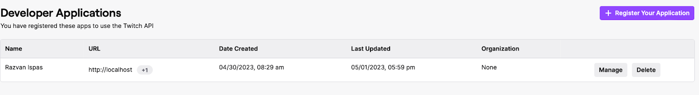
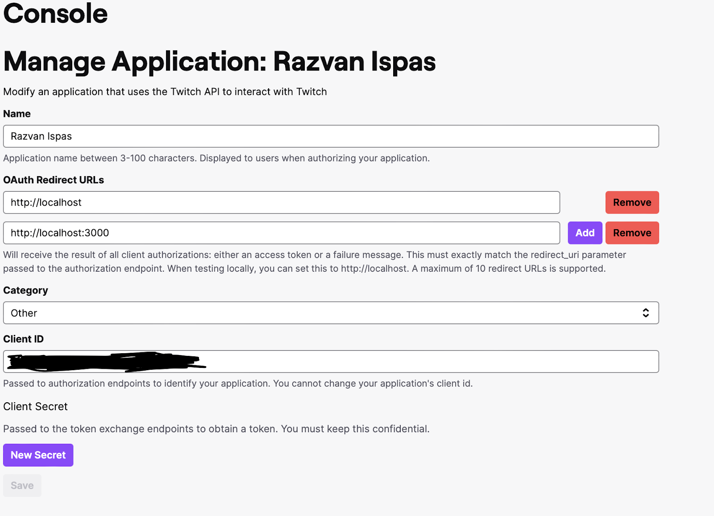
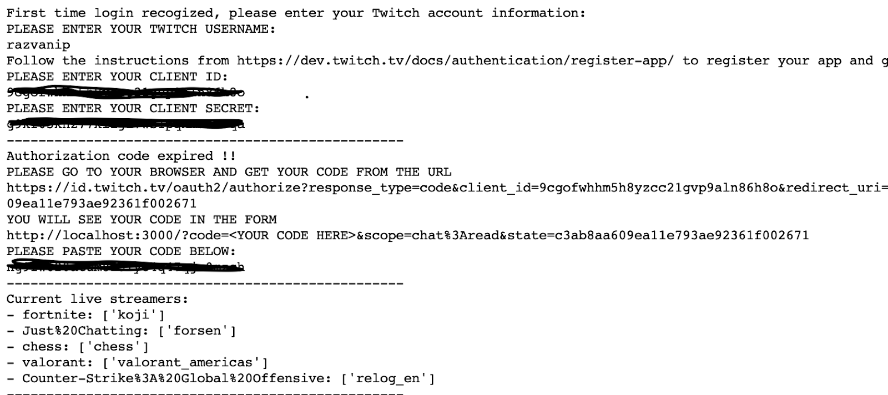
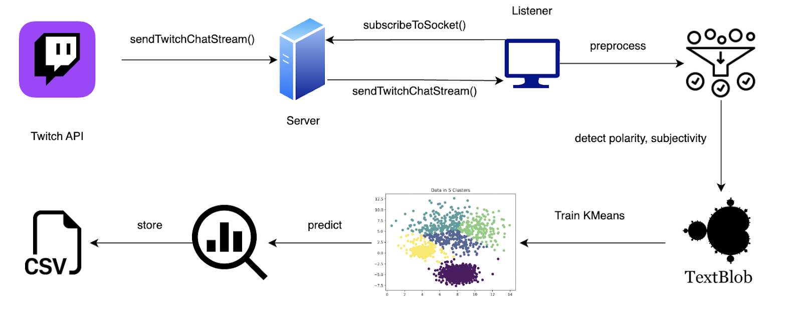

# Processing API Data as a Stream: A Report

**Authors:** Khuong Thanh-Gia-Hieu, Alex-Răzvan Ispas

In this report, we present a comprehensive analysis of clustering Twitch chat messages from the most viewed streams across five categories using sentiment analysis and K-means clustering. The project aims to analyze the Twitch chat messages from the most viewed streams of five categories: Fortnite, Just Chatting, Chess, Valorant, and Counter-Strike.

## Methodology

### Obtaining Access on Twitch Developers

To connect to the Twitch API, follow these steps:

1. Create an account on the [Twitch developer website](https://dev.twitch.tv/).
2. Register for API access.
   
3. After your application is accepted, press "Manage" and set the URL to `localhost` with the port `3000`.
4. Enable two-factor authentication.
   

### Connecting to Twitch API

To connect to the Twitch API, you will need the following credentials:

- Your Twitch nickname
- The application key
- Your secret key

The `connect_twitch_to_socket.py` script provides a user interface that guides you through the process of adding your credentials. After completing these steps for the first time, your credentials will be saved in `twitch_info.json` and `oauth-keys.json`.

### Analyzing Retrieved Data

To analyze the Twitch chat messages, use the `twitch_chat_analysing.py` script. This script retrieves the data stream via the socket and performs the following analyses on the chat messages:

1. Clean the Twitch chat messages by removing elements that do not represent words.
2. Use the TextBlob library to detect sentiment polarity and subjectivity for each category.
3. Merge the game, sentiment (polarity and subjectivity), and its vectorized version for each entry in the stream.
   

### Category Clustering

After collecting sentiment data for each entry, the polarity and subjectivity values are used to train a KMeans model in the streaming context. The K-means clustering algorithm is applied to the vectorized sentiment data to group the chat messages into five distinct clusters. The model is configured with k=5 (the same number of centroids as the number of categories) and a decay factor of 0.1 to update the cluster centroids as new data arrives.

### Real-time Visualization

The asynchronous Python script in the `visualization.ipynb` notebook uses Matplotlib and Seaborn libraries to generate a scatter plot of the chat messages' sentiment values. The visualization provides a better understanding of the clustering results and how they change over time.

## Results and Discussion

After running the analysis, it was observed that the clusters learned by the K-means model did not clearly differentiate between the categories. The sentiment polarity and subjectivity were found to be quite similar across the different categories, leading to overlapping clusters. This can be attributed to shared sentiment patterns across categories, noise in chat data, and the limited features used for clustering.

## Conclusion

This project aimed to analyze and cluster Twitch chat messages from the most viewed streams of five categories using sentiment analysis and K-means clustering. Although the clusters learned by the model did not clearly differentiate between the categories, the project provided insights into the challenges of clustering chat data and the procedures of working with Spark Streaming and APIs.
